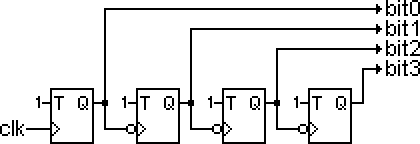
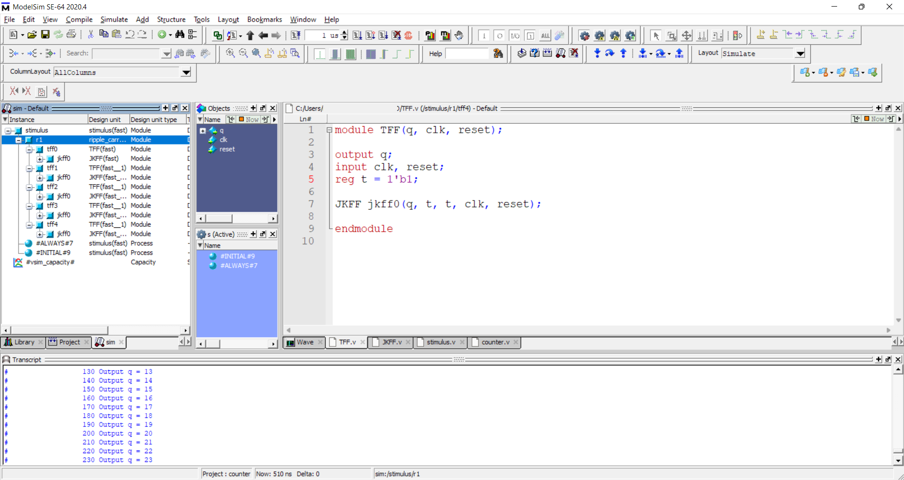
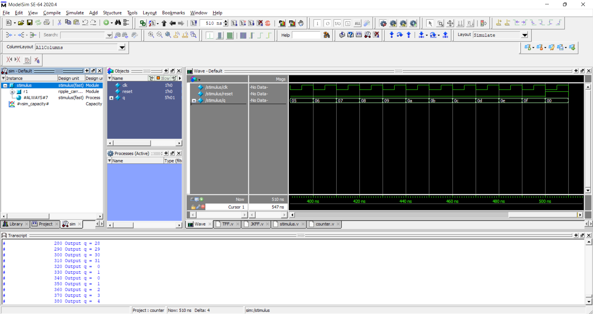
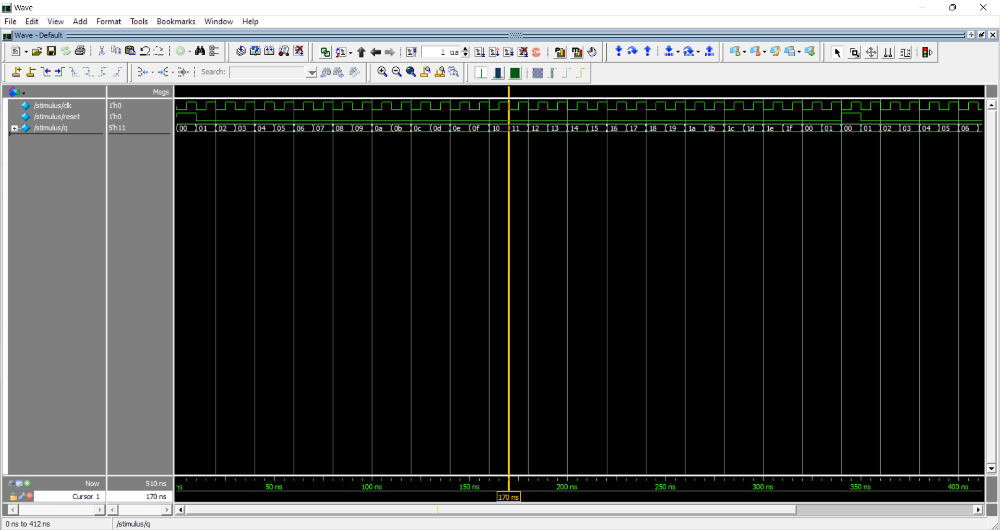

# گزارش کار تمرین ۱ طراحی سیستم‌های دیجیتال
> علیرضا حبیب‌زاده `99109393`

## طراحی JK-flipflop
برای طراحی این قطعه که قطعه‌ی پایه‌ای مدارمان است، از روش توصیف Behavioral استفاده می‌کنیم. برای این کار فایلی با عنوان دلخواه مثلا `JKFF.v` می‌سازیم. سپس
در آن کد زیر را قرار می‌دهیم.
‍
```verilog
module JKFF(q, j, k, clk, reset);

output q;
input j, k, clk, reset;
reg q;

always @(posedge reset or negedge clk)
	if (reset)
		q = 1'b0;
	else
		if (j && k)
			q = ~q;
		else if (j && ~k)
			q = 1'b1;
		else if (k && ~j)
			q = 1'b0;
		// else do nothing (j = k = 0)
endmodule
```

در این کد رفتار قطعه به ازای حالت‌های مختلف `j` و‍ ‍`k` و همچنین `reset` توصیف شده است. پس از این که این کد به درستی در نرم‌افزار کامپایل شد به قسمت بعد می‌رویم.

## طراحی T-flipflop
برای طراحی این قطعه کافی است از حالت `j = k = 1` در همان فلیپ‌فلاپ JK استفاده کنیم. پس کافی است یک رجیستر ثابت 1 تعریف کنیم و آن را به ورودی‌های یک instance از فلیپ‌فلاپ JK که در بخش قبل طراحی کردیم بدهیم.
```verilog
module TFF(q, clk, reset);

output q;
input clk, reset;
reg t = 1'b1;

JKFF jkff0(q, t, t, clk, reset);

endmodule
```

## طراحی شمارنده
حال مطابق تصویر زیر module ‍‍شمارنده‌مان را پیاده می‌کنیم. برای این کار ۵ instance از فلیپ‌فلاپ T که پیشتر طراحی کردیم لازم است. 



البته این مربوط به یک شمارنده ۴ بیتی است تعمیم آن به ۵ بیت واضح است. کافی است یک فلیپ‌فلاپ دیگر سمت راست اضافه کنیم. کد نهایی در زیر آمده.

```verilog
module ripple_carry_counter(q, clk, reset);

output [4:0] q;
input clk, reset;

TFF tff0(q[0], clk, reset);
TFF tff1(q[1], q[0], reset);
TFF tff2(q[2], q[1], reset);
TFF tff3(q[3], q[2], reset);
TFF tff4(q[4], q[3], reset);

endmodule
```

## طراحی testbench
حال که طراحی مدار کامل شده باید moduleای طراحی کنیم که آن را تست کند. برای این کار از شمارنده‌مان instance می‌گیریم و کلاک آن را به صورتی که در زیر آمده تولید می‌کنیم.
همچنین برای مشاهده‌ی خروجی در کنسول می‌توانیم از دستور `monitor` استفاده کنیم.

```verilog
module stimulus;
reg clk; reg reset; wire[4:0] q;

ripple_carry_counter r1(q, clk, reset);

initial clk = 1'b0;
always #5 clk = ~clk;

initial
begin
$monitor($time, " Output q = %d", q);
reset = 1'b1;
#10 reset = 1'b0;
#330
reset = 1'b1;
#10 reset = 1'b0;
#150;
reset = 1'b1;
#10 reset = 1'b0;
$stop;
end
endmodule
```
کد بالا کلاکی با دوره تناوب ۱۰ نانوثانیه ایجاد می‌کند و آن را به شمارنده می‌دهد. پس از ۳۳ کلاک شمارنده آن را ریست کرده و سپس ۱۵ کلاک دیگر صبر می‌کند تا دوباره آن را ریست کند. سپس شبیه‌سازی را متوقف می‌کند.

## شبیه‌سازی
برای شبیه‌سازی ابتدا کل پروژه را compile می‌کنیم. سپس اگر اروری وجود داشت آن را رفع می‌کنیم تا کل پروژه به درستی compile شود. حال شبیه‌سازی را درخواست می‌دهیم. در این قسمت ممکن است نرم‌افزار optimizationهایی انجام دهد که hierarchy پروژه را تغییر دهد. در صورتی که برای دیباگ کردن یا کاربردهای آموزشی یا مسائل دیگر نیاز به مشاهده‌ی کامل آن داریم باید در قسمت
optimization آن را فعال کنیم. (یا به کلی optimization را غیرفعال کنیم.)

> محیط کلی شبیه‌ساز و نمایش hierarchy


> محیط simulation


> موج‌های ورودی و خروجی


### خروجی کنسول

```
# ** Note: (vsim-8009) Loading existing optimized design _opt1
# Loading work.stimulus(fast)
# Loading work.ripple_carry_counter(fast)
# Loading work.TFF(fast)
# Loading work.JKFF(fast)
# Loading work.TFF(fast__1)
# Loading work.JKFF(fast__1)
run
#                    0 Output q =  0
#                   10 Output q =  1
#                   20 Output q =  2
#                   30 Output q =  3
#                   40 Output q =  4
#                   50 Output q =  5
#                   60 Output q =  6
#                   70 Output q =  7
#                   80 Output q =  8
#                   90 Output q =  9
#                  100 Output q = 10
#                  110 Output q = 11
#                  120 Output q = 12
#                  130 Output q = 13
#                  140 Output q = 14
#                  150 Output q = 15
#                  160 Output q = 16
#                  170 Output q = 17
#                  180 Output q = 18
#                  190 Output q = 19
#                  200 Output q = 20
#                  210 Output q = 21
#                  220 Output q = 22
#                  230 Output q = 23
#                  240 Output q = 24
#                  250 Output q = 25
#                  260 Output q = 26
#                  270 Output q = 27
#                  280 Output q = 28
#                  290 Output q = 29
#                  300 Output q = 30
#                  310 Output q = 31
#                  320 Output q =  0
#                  330 Output q =  1
#                  340 Output q =  0
#                  350 Output q =  1
#                  360 Output q =  2
#                  370 Output q =  3
#                  380 Output q =  4
#                  390 Output q =  5
#                  400 Output q =  6
#                  410 Output q =  7
#                  420 Output q =  8
#                  430 Output q =  9
#                  440 Output q = 10
#                  450 Output q = 11
#                  460 Output q = 12
#                  470 Output q = 13
#                  480 Output q = 14
#                  490 Output q = 15
#                  500 Output q =  0
```
