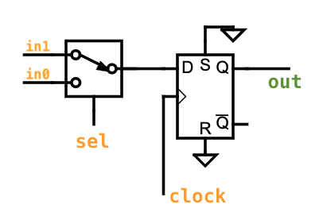

# تمرین ۲ طراحی سیستم‌های دیجیتال
> Alireza Habibzadeh `99109393`

## 4
### A
```verilog
always @(posedge clock)
if(reset)
out <= 0;
else
out <= in;
```

در این مدار reset **ناهم‌زمان** است. چرا که بلاک `always` تنها با هر لبه‌ی بالارونده‌ی کلاک اجرا می‌شود.

در هر لبه‌ی بالارونده‌ی کلاک مقدار `in` در `out` ظاهر می‌شود و مستقل از تغییر `in` بین دو کلاک، این مقدار در `out` تا کلاک بعدی حفظ می‌شود. پس می‌توان گفت این قطعه یک D-flipflop است که ورودی `in` به `D` وصل شده.
ورودی‌های `clock` و `reset` هم به پایه‌های متناظرشان وصل هستند.
فلیپ‌فلاپ استفاده شده هم از نوع
Active High
است و مقدار اولیه‌ی خروجی پس از ریست `0` می‌باشد.
### B
```verilog
always @(posedge clock)
if(reset)
out <= 0;
else if(!clear)
out <= in;
```

در این مدار نیز به همان دلیل قبلی reset **ناهم‌زمان** است.

مدار اینجا نیز همان D-flipflop قبلی است با این تفاوت که فلیپ‌فلاپ ما دارای پایه‌ی `enable` است و تنها در صورت فعال بودن این پایه مقداردهی به `in` انجام می‌شود. ورودی `clear` را باید به نات (وارون) `enable‍` وصل کنیم چرا که در صورت `0` بودن `clear`
مقداردهی انجام می‌شود (`enable = 1`) و در صورت `1` بودن `clear` مقداردهی انجام نمی‌شود (`enable = 0`).
یا می‌توان گفت که پایه‌ی `enable` فلیپ‌فلاپ ما از نوع Active Low است و `clear‍‍` مستقیم به آن وصل شده یا از نوع Active High است و `enable = ~clear`.

### C
```verilog
always @(posedge clock)
if(sel)
out <= in0;
else
out <= in1;
```



یک مالتی‌پلکسر داریم که `sel` بین `in0` و `in1` انتخاب می‌کند. سپس خروجی تا کلاک بعدی latch می‌شود. 

### D
```verilog
always @(posedge clock)
if(!clear)
out <= in;
```

### E
```verilog
always @(posedge clock or
posedge
reset)
if(reset)
out <= 0;
else
out <= in;
```

در این مدار reset **هم‌زمان** است. چرا که با لبه‌ی بالارونده‌ی reset نیز بلاک `always` اجرا شده و کاری که برای reset تعریف کردیم را انجام می‌دهد.

